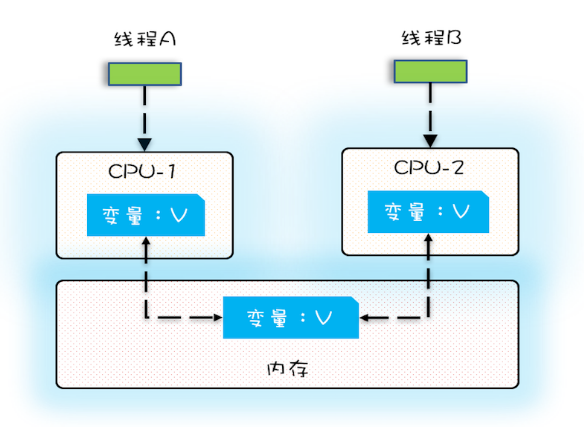
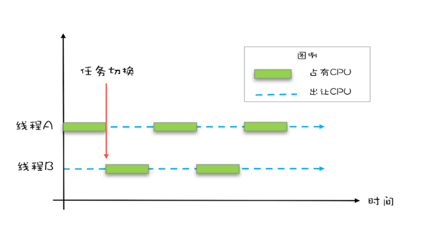
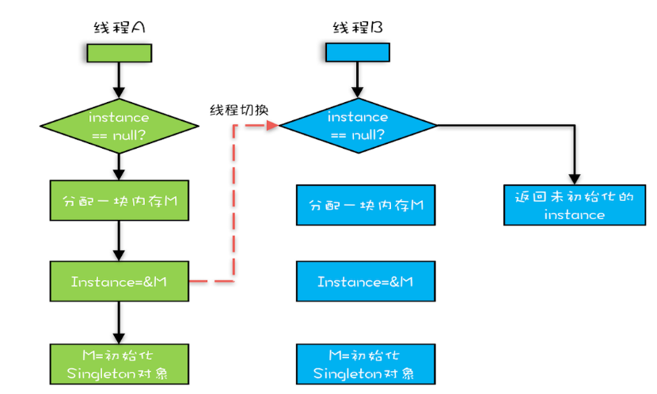

# Java并发

# 0.概念

## 0.1 并发编程Bug的三个源头

有一个**核心矛盾一直存在，就是CPU、内存、I/O 这三者的速度差异**。为了合理利用 CPU 的高性能，平衡这三者的速度差异，计算机体系机构、操作系统、编译程序都做出了贡献，主要体现为：

1. CPU 增加了缓存，以均衡与内存的速度差异；
2. 操作系统增加了进程、线程，以分时复用 CPU，进而均衡 CPU 与 I/O 设备的速度差异；
3. 编译程序优化指令执行次序，使得缓存能够得到更加合理地利用。

天下没有免费的午餐，并发程序很多诡异问题的根源也在这里。

### 0.1.1 缓存导致的可见性问题

一个线程对共享变量的修改，另外一个线程能够立刻看到，我们称为**可见性**。



**多核**时代，每颗 CPU 都有自己的缓存，这时 CPU 缓存与内存的数据一致性就没那么容易解决了，当多个线程在不同的 CPU 上执行时，这些线程操作的是不同的 CPU 缓存。

### 0.1.2 线程切换带来的原子性问题

操作系统做任务切换，可以发生在任何一条**CPU 指令**执行完。



**一个或者多个操作在 CPU 执行的过程中不被中断的特性称为原子性**。CPU 能保证的原子操作是 CPU 指令级别的，而不是高级语言的操作符，这是违背直觉的地方。因此，很多时候需要在高级语言层面保证操作的原子性。

### 0.1.3 编译优化带来的有序性问题

有序性指的是程序按照代码的先后顺序执行。指令重排是指在程序执行过程中, 为了性能考虑, 编译器和CPU可能会对指令重新排序.指的是CPU指令重排。

```java
public class Singleton {
  static （volatile） Singleton instance;
  static Singleton getInstance(){
    if (instance == null) {
      synchronized(Singleton.class) {
        if (instance == null)
          instance = new Singleton();
        }
    }
    return instance;
  }
}
```

不加volatile导致指令重排。new 操作应该是：

1. 分配一块内存 M；
2. 在内存 M 上初始化 Singleton 对象；
3. 然后 M 的地址赋值给 instance 变量。

但是实际上优化后的执行路径却是这样的：

1. 分配一块内存 M；
2. 将 M 的地址赋值给 instance 变量；
3. 最后在内存 M 上初始化 Singleton 对象。




这个时候访问 instance 的成员变量就可能触发空指针异常。

## 0.2 Java内存模型

**现在要做的是按需禁用缓存以及编译优化**。

Java 内存模型是个很复杂的**规范**，规范了 JVM 如何提供按需禁用缓存和编译优化的方法。这些方法包括 **volatile**、**synchronized** 和 **final** 三个关键字，以及六项 **Happens-Before 规则**。

## 0.3 Happens-Before 规则

Happens-Before 约束了编译器的优化行为，虽允许编译器优化，但是要求编译器优化后一定遵守 Happens-Before 规则。

### 0.3.1 程序的顺序性规则

程序前面对某个变量的修改一定是对后续操作可见的。

### 0.3.2 volatile 变量规则

对一个 volatile 变量的写操作， Happens-Before 于后续对这个 volatile 变量的读操作。

### 0.3.3 传递性

这条规则是指如果 A Happens-Before B，且 B Happens-Before C，那么 A Happens-Before C。

这就是 1.5 版本对 volatile 语义的增强，这个增强意义重大，1.5 版本的并发工具包（java.util.concurrent）就是靠 volatile 语义来搞定可见性的。

### 0.3.4 管程中锁的规则

synchronized 是 Java 里对管程的实现。

对一个锁的解锁 Happens-Before 于后续对这个锁的加锁。

### 0.3.5 线程 start() 规则

这条是关于线程启动的。它是指主线程 A 启动子线程 B 后，子线程 B 能够看到主线程在启动子线程 B 前的操作。

```java
Thread B = new Thread(()->{
  // 主线程调用 B.start() 之前
  // 所有对共享变量的修改，此处皆可见
  // 此例中，var==77
});
// 此处对共享变量 var 修改
var = 77;
// 主线程启动子线程
B.start();
```

### 0.3.6 线程 join() 规则

如果在线程 A 中，调用线程 B 的 join() 并成功返回，那么线程 B 中的任意操作 Happens-Before 于该 join() 操作的返回。

```java
Thread B = new Thread(()->{
  // 此处对共享变量 var 修改
  var = 66;
});
// 例如此处对共享变量修改，
// 则这个修改结果对线程 B 可见
// 主线程启动子线程
B.start();
B.join()
// 子线程所有对共享变量的修改
// 在主线程调用 B.join() 之后皆可见
// 此例中，var==66
```

## 0.4 final

**final 修饰变量时，初衷是告诉编译器：这个变量生而不变，可以可劲儿优化。**

### 0.4.1 修饰类

修饰类当用final去修饰一个类的时候，表示这个类不能被继承。

一般来说工具类往往会设计称为final类。在JDK中，被设计为final类的有String、System等。

### 0.4.2 修饰方法

被final修饰的方法不能被重写。

注：一个类的private方法会隐式的被指定为final方法。

### 0.4.3 修饰成员变量

必须要赋初值，而且是只能初始化一次。赋值的方式有两种，1，直接赋值，2，全部在构造方法中赋初值。

如果修饰的成员变量是基本类型，则表示这个变量的值不能改变。如果修饰的成员变量是一个引用类型，则是说这个引用的地址的值不能修改，但是这个引用指向的对象里面的内容是可以改变的。

### 0.4.4 修饰形参

该参数不可以再赋值，可以防止在方法里面不小心重新赋值，造成不必要的麻烦。