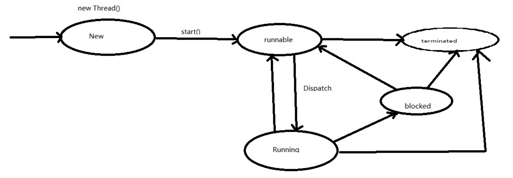
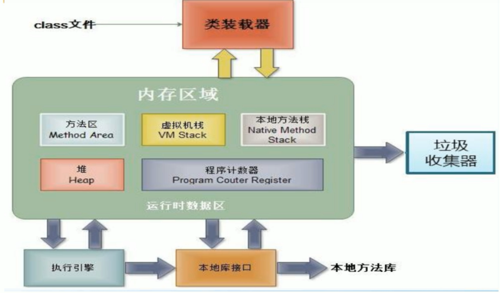
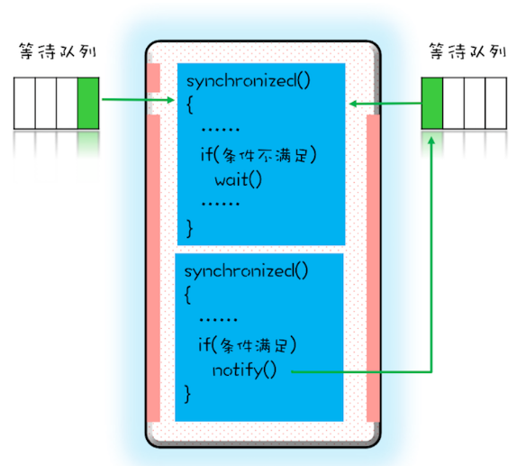

# 并发编程第一阶段
## 0. 一些工具

1. jconsole,运行程序
2. jps cmd命令，jstack cmd命令
3. javap -c 反编译
4. kill -9 线程号 强制退出

## 1.线程创建与启动以及线程状态

### 1.1 新建线程

start() run()

```java
Thread thread1=new Thread();//此时target为null
thread1.start();//开启一个线程,start方法是在一个新的操作系统线程调用run方法，此方法不会阻塞main线程。
Thread thread2=new Thread();
thread2.run();//不能开启线程，在调用run的当前线程去执行操作。
```

run start运用了模板模式

真正调用run的是start0()函数，即native

### 1.2 正确建立线程的两种方式

```java
//1 此种方法为匿名内部类，可重写父类的run方法
Thread newThread1=new Thread(){
    @Override
    public void run() {
        System.out.println("newThread-1");
    }
};
newThread1.start();
//2 传入Runnable接口的实现,此法也是匿名内部类
Thread newThread2=new Thread(new Runnable() {
    @Override
    public void run() {
        System.out.println("newThread-2");
    }
});
newThread2.start();
```

### 1.3 线程的生命周期



block无法直接回到running

### 1.4 Thread API

#### 1.4.1 构造函数

1. 创建线程对象Thread，默认有线程名，以Thread-开头，从0开始计数。Thread()

2. 如果在构造Thread时没有传递Runnable或者复写Thread的run方法，将不会调用任何东西。Thread(Runnable target)

3.  如果构造线程对象时未传入ThreadGroup，Thread会默认获取父线程（极为启动该线程的线程）的ThreadGroup作为该线程的ThreadGroup，此时子线程和父线程将会在同一个ThreadGroup。 

4. 构造Thread时传入stacksize代表该线程占用的stack大小。如果没有指定大小，默认为0，代表着会忽略该参数，该参数会被JNI函数去使用，需要注意：该参数对一些平台有效，在有些平台无效。其中JVM参数为-Xss10M。

#### 1.4.2 join

 t2,t3之间可以交替执行，但是主线程一直等待t2,t3结束后再往下执行

```
Thread t2=new Thread(()-> {
    try {
        Thread.sleep(1000);
    } catch (InterruptedException e) {
        e.printStackTrace();
    }
});
Thread t3=new Thread(()-> {
    try {
        Thread.sleep(1000);
    } catch (InterruptedException e) {
        e.printStackTrace();
    }
});
t2.start();
t3.start();
t2.join();
t3.join();
```

   join中带参数表示等待时间，到了时间后主线程不在等继续往下执行。

   ### 1.4.3 interrupt

```java
* 直接interrupt不会有反应的
* interrupt()实际上只是给线程设置一个中断标志，线程仍会继续运行。
* 如果正在运行wait()，sleep()，join()这三个方法阻塞了线程，那么将会使得线程抛出InterruptedException异常，
* 这是一个中断阻塞的过程。如果是其它的正在运行的状态，
* 那么将不会有任何影响，也不会中断线程，或者抛出异常，只会会打上一个中断线程的标志，是否中断线程，将由程序控制。
```

```java
Thread thread2=new Thread(new Runnable() {
    @Override
    public void run() {
        //优雅的方式中断线程
        while (true) {
            if (Thread.currentThread().isInterrupted()) {
                System.out.println("thread2 break");
                //break while循环
                break;
            }
            System.out.println("Thread2 is here");
        }
    }
});
thread2.start();
thread2.interrupt();
```

```java
Thread thread3=new Thread(new Runnable() {
    @Override
    public void run() {
        while (true){
            if (Thread.currentThread().isInterrupted()){
                break;
            }
            try{
                Thread.sleep(2000);
            }catch (InterruptedException e){
                //别人进行中断时会抛出异常
                //抛出异常后会进行中断标志位的清除
                //所以要在此处设置中断状态
                Thread.currentThread().interrupt();
            }
        }
    }
});
```

## 1.5 线程与JVM



**方法区**是被所有线程共享，所有字段和方法字节码，以及一些特殊方法如构造函数，接口代码也在此定义。简单说，所有定义的方法的信息都保存在该区域，此区域属于共享区间。**静态变量+常量+类信息+运行时常量池存在方法区中，实例变量存在堆内存中。**

**虚拟机栈**由每个线程的栈帧（Stack Frame）组成，即**每个线程分着用**，栈帧是一个内存区块，是一个数据集，是一个有关方法和运行期数据的数据集。**栈帧**在线程创建时创建，为**线程私有**，它的生命期是跟随线程的生命期，线程结束栈内存也就释放，对于栈来说不存在垃圾回收问题。**基本类型的变量和对象的引用变量都是在函数的栈内存中分配。**

### 总结

1. java应用程序的main函数是一个线程，是被JVM启动的时候调用，线程的名字叫做main。
2. 实现一个线程，必须创建Thread实例，override run方法，并且调用start方法。
3. 在JVM启动后，实际上有多个线程，但是至少有一个非守护线程。
4. 当调用一个线程start方法时，至少有两个线程，一个当前线程，还有一个执行创建出的线程。
5. 线程的生命周期分为new,**runnable**,running,block,termate。


## 2.Runnable接口详细详解

Runnable接口与Thread类是一种策略模式

## 3.线程优先级以及守护线程详解

### 3.1守护线程

主线程结束，守护线程立即结束了。

程序在没有非守护线程运行时结束。

### 3.2线程优先级

设置了优先级高就有更高的概率获得CPU执行时间，不绝对获得

### 3.3 Hook

```java
Runtime.getRuntime().addShutdownHook(new Thread(()->{
    System.out.println("关闭之前处理一些事情");
}));
```

注：kill -9 是强制杀除，不会有机会去让线程去处理一些事情。

### 3.4 线程异常捕获

```java
Thread t=new Thread(()->{
   int result=1/0;
});
t.setUncaughtExceptionHandler((thread,e)->{
    System.out.println(e);
    System.out.println(thread);
});
t.start();
```

### 3.5 得到当前线程函数堆栈

```java
Arrays.asList(Thread.currentThread().getStackTrace()).stream()
        .filter(e->!e.isNativeMethod())
        .forEach(e-> Optional.of(e.getMethodName())
        .ifPresent(System.out::println)
        );
```

## 4.线程同步(synchronized)

**解决原子性问题。**

```java
class X {
    // 4.1 修饰非静态方法
    synchronized void foo() {
        // 临界区
    }
    // 4.2 修饰静态方法
    synchronized static void bar() {
        // 临界区
    }
    // 4.3 修饰代码块
    Object obj = new Object();
    void baz() {
        synchronized(obj) {
            // 临界区
        }
    }
}
```

修饰代码块的时候，锁定了一个 obj 对象,修饰静态方法的时候，锁定的是当前类的 Class 对象,修饰非静态方法的时候，锁定的是当前实例对象 this。


## 5.线程间通讯



wait()时当前就放弃锁，进入右侧MONITOR的**wait等待队列**，**notify() 是会随机地通知等待队列中的一个线程，而 notifyAll() 会通知等待队列中的所有线程**。被通知的线程要想重新执行，仍然需要获取到互斥锁。也就是notifyAll将右边wait等待队列移到了左边重新来竞争锁。

###  sleep与wait

  wait与sleep区别在于：

1. wait会释放持有锁并加入等待锁队列 而sleep不会释放锁资源.

2. wait只能在同步方法和同步块中使用，而sleep任何地方都可以.
3. sleep是Thread的方法，而wait是Object类的方法
4. sleep方法调用的时候必须指定时间

两者相同点：都会让渡CPU执行时间，等待再次调度！  

## 6.线程池详解

池中保持一定的线程，避免了创建和销毁线程带来的开销。

线程池应注意的要素：

1. 任务队列
2. 拒绝策略（抛出异常，直接丢弃，阻塞，临时队列）
3. 初始化值 init
4. active
5. max 线程不能一味增加

 

