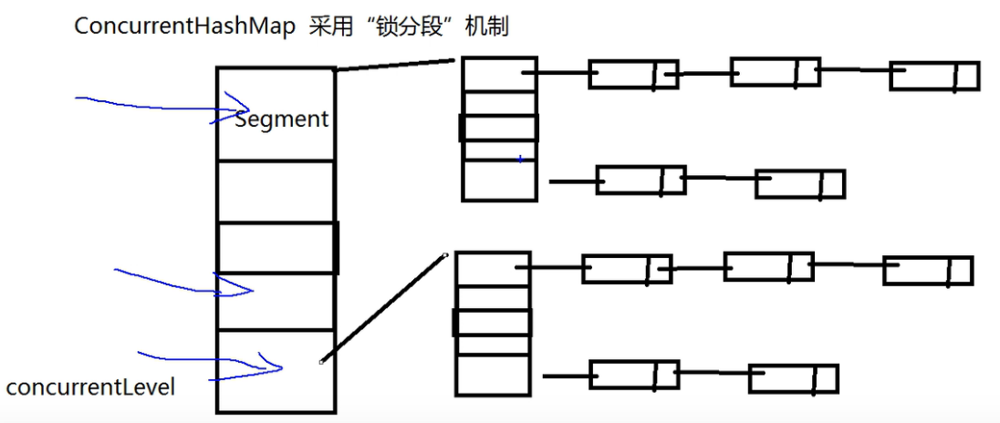
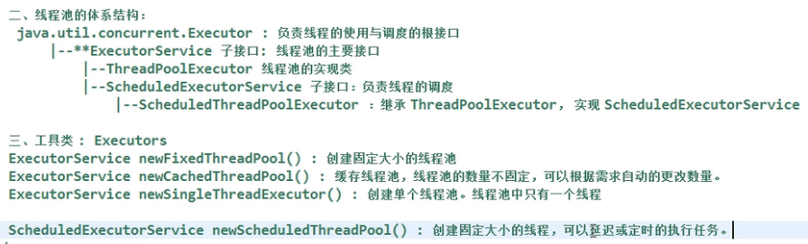
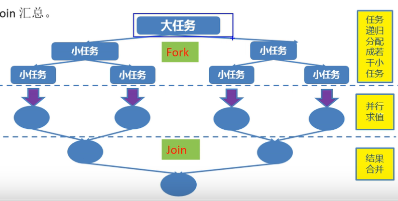

# JUC

# 1. 原子变量与CAS算法

jdk1.5后java.util.concurrent.atomic包中提供了常用原子变量。

原子变量特点：

1. 具有volatile特性，保证内存可见性。
2. CAS（Compare-And-Swap）算法保证数据的原子性。

CAS算法是硬件对于并发操作共享数据的支持。包含了三个操作数：内存值V 预估值A 更新值B 当且仅当V==A时，V=B，否则将不做任何操作。

可以把这一个过程分为两步，第一步读取V，第二步比较与替换 A为再次读取的值，与V比较，相等时则替换为B。否则不替换。

CAS通常一旦失败了再来。

# 2.ConcurrentHashMap锁分段机制

HashMap线程不安全，Hashtable线程安全。Hashtable把全表锁上效率太低。

java5.0在java.util.concurrent包中提供了多种并发容器类来改进同步容器的性能。

ConcurrentHashMap同步容器类是Java5增加的一个线程安全的哈希表。对多线程的操作介于HashMap与Hashtable之间。内部采用锁分段机制替代Hashtable的独占锁。进而提高性能。

ConcurrentLevel默认为16，也就是默认有16个段。每个段都是一个独立的锁。



jdk1.8后把锁分段也取消了，采用CAS。

# 3.CountDownLatch闭锁

CountDownLatch是一个同步辅助类，在完成一组正在其他线程中执行的操作之前，允许一个或多个线程一直等待。

闭锁可以延迟线程的进度直到其到达终止状态，闭锁可以用来确保某些活动直到其他活动都完成才继续执行：

1. 确保某个计算在其需要的所有资源都被初始化之后才继续执行。
2. 确保某个服务在其依赖的所有其他服务都已经启动之后才启动。
3. 等待直到某个操作所有参与者都准备就绪再继续执行。

```java
package zdk.JUC;
```

# 4.实现Callable接口

创建执行线程的方式三：实现Callable接口。

相较于实现Runnable接口的方式，方法可以有返回值，并且可以抛出异常。

执行Callable方式，需要FutureTask实现类的支持，用于接收运算结果。FutureTask是Future接口的实现类。

FutureTask也可以用于闭锁。

# 5.同步锁Lock

用于解决多线程安全问题的方法：

synchronized 同步代码块，同步方法(隐式锁)

jdk1.5以后 同步锁Lock（显式锁）

需要通过lock()方法上锁，必须通过unlock()方式进行释放锁。

# 6.生产者消费者

加上等待唤醒机制。

将wait使用在while中解决 **多生成者消费者** 的虚假唤醒问题。实际上推荐将wait使用在while中，多加一次判断。

```Java
package zdk.JUC;
```

# 7.Condition线程通信

lock也有自己的wait和notify方式。即为condition

在Condition对象中，与wait,notify和notifyAll方法对应的分别是await,signal,signalAll。

condition通过lock.newCondition获取。

# 8.线程按序交替

编写一个程序，开启3个线程，这3个线程的ID分别是A，B，C，每个线程将自己的ID在屏幕上打印10遍，要求输出的结果必须按顺序显示。ABCABCABC

# 9.ReadWriteLock

写写，读写互斥，读读不需要互斥

# 10.线程池

提供一个线程队列，队列中保存着所有等待状态的线程，避免了创建于销毁线程的额外开销，提高了速度。



见ScheduledThreadPoolTest.java以及ThreadPoolTest.java

# 11.ForkJoinPool分支合并框架 工作窃取

该框架就是在必要的情况下，将一个大任务，进行拆分(fork)成若干个小任务(拆到不可再拆时)，再将一个个小任务运算的结果进行join汇总。



ForkJoin框架需要ForkJoinPool的支持。

工作窃取(work-stealing)算法是指某个线程从其他队列里窃取任务来执行。某个CPU任务执行完毕后，会从其他CPU的任务队列的末尾取出任务来执行，充分利用CPU。JDK1.7引入的Fork/Join框架就是基于工作窃取算法